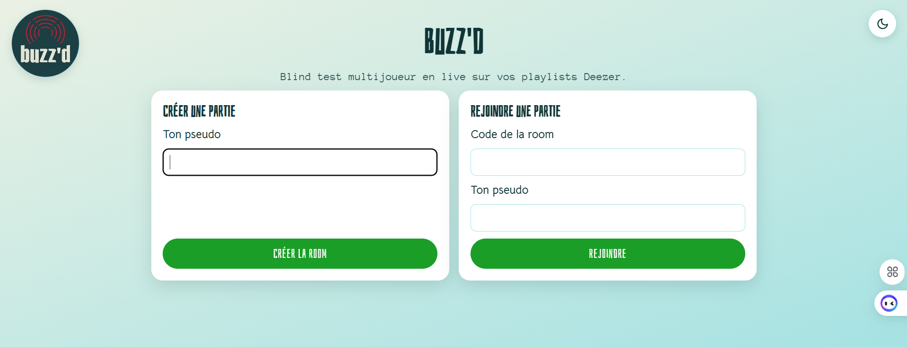
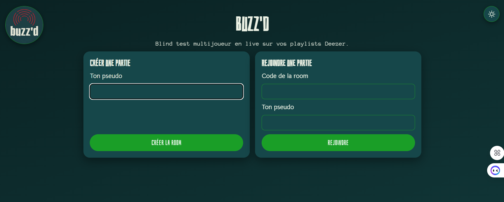
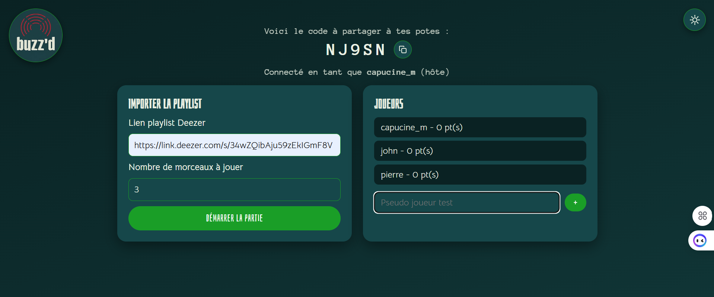
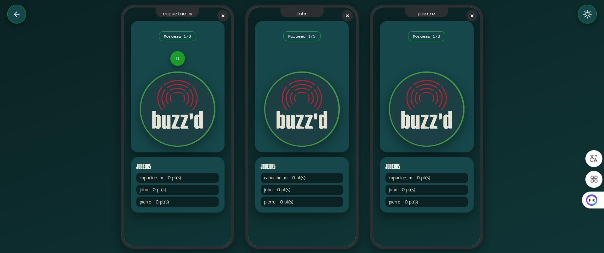

# Buzz'd 

Blind test multijoueur en live : donne une playlist Deezer, tes potes rejoignent la partie depuis leur téléphone avec un pseudo, et l'app balance des extraits au hasard. Premier à buzzer et à trouver le bon titre ou artiste marque un point.

## Stack

- **Backend** : Python + FastAPI, WebSocket natif (Starlette) pour synchroniser les joueurs en temps réel
- **Persistance** : SQLite, accès direct (`sqlite3`)
- **Frontend** : HTML/Jinja2 + JS vanilla (pas de framework JS)
- **API externes** :
  - [Deezer](https://developers.deezer.com/api) pour récupérer les morceaux d'une playlist
  - [Groq](https://groq.com/) pour la validation floue des réponses (fautes de frappe, surnoms d'artiste)

## Fonctionnalités

- **Création de room** : un joueur crée une partie et obtient un code à 5 caractères à partager
- **Import de playlist Deezer** : colle l'URL complète (ou un lien court `link.deezer.com`), l'app en extrait l'ID et récupère titre/artiste/extrait 30s de chaque morceau
- **Buzzer en temps réel** : premier appui verrouille le buzzer pour les autres et ouvre le champ de réponse
- **Validation des réponses** : comparaison texte normalisée (accents, casse, ponctuation) puis, si pas de correspondance exacte, appel à Groq pour juger l'équivalence
- **Scores en direct** et **classement final** en fin de partie
- **Enchaînement automatique** des manches, avec révélation forcée si personne ne buzze à temps
- **Rejouer** la même playlist en un clic (scores et morceaux joués réinitialisés)
- **Vue démo multi-téléphones** (`/demo/{code}`) : affiche plusieurs cadrans façon téléphone (chacun une iframe vers la room) pour visualiser toute la partie sur un seul écran sans matériel supplémentaire
- **Gestion de déconnexion de l'hôte** : la partie se termine automatiquement si l'hôte quitte sans se reconnecter (délai de grâce pour un simple reload)

## Lancer le projet

```bash
python -m venv .venv
.venv\Scripts\activate       # Windows
pip install -r requirements.txt
```

Crée un fichier `.env` à la racine avec ta clé Groq :

```
GROQ_API_KEY=ta_clé_ici
```

Puis démarre le serveur :

```bash
uvicorn main:app --reload --port 8002
```

L'app est accessible sur [http://localhost:8002](http://localhost:8002).

## Structure du projet

```
main.py          # Routes FastAPI, WebSocket, orchestration des manches
database.py      # Connexion SQLite + schéma (rooms, players, tracks)
game.py          # Requêtes DB (rooms, joueurs, morceaux, scores, classement)
deezer.py        # Résolution d'URL et récupération des morceaux via l'API Deezer
groq_client.py   # Appel à Groq pour la validation floue des réponses
validation.py    # Normalisation et comparaison texte (accents, casse, ponctuation)
round_state.py   # État en mémoire de la manche en cours (buzzer, révélation)
ws_manager.py    # Gestion des connexions WebSocket par room
templates/       # Pages Jinja2 (accueil, room, démo multi-téléphones)
static/          # CSS, JS vanilla, assets
```

## Modèle de données (SQLite)

- **rooms** : `code`, `host_nickname`, `playlist_url`, `status` (`lobby` / `playing` / `finished`)
- **players** : `room_code`, `nickname`, `score`
- **tracks** : `room_code`, `position`, `deezer_track_id`, `title`, `artist`, `preview_url`, `played`

## Sécurité

- Toutes les actions qui modifient l'état (créer une room, buzzer, répondre...) passent en POST, jamais en GET
- Requêtes SQL exclusivement paramétrées (pas de concaténation de chaînes)
- Clé API Groq lue depuis `.env`, jamais en dur dans le code, `.env` exclu de git
- Timeouts sur tous les appels HTTP externes (Deezer, Groq)
- Liste blanche de domaines pour la résolution des liens courts Deezer (anti-SSRF)

## Aperçu








